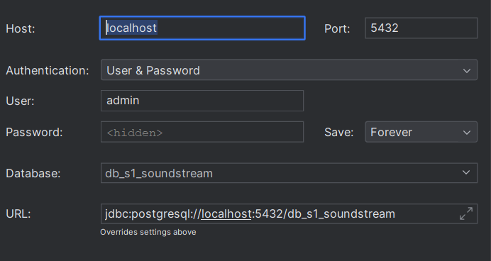

# Instalación y despliegue de la base de datos

Sigue estos pasos para construir y levantar un contenedor Docker que ejecuta PostgreSQL con tablas predefinidas.

## Pasos para Desplegar

1. **Construir la Imagen Docker**

   Ejecuta el siguiente comando en el directorio donde se encuentra el `Dockerfile` y el archivo `init.sql`:

   ```bash
   docker build -t db-soundstream .
   ```
2. **Levantar el Contenedor**

   Para levantar el contenedor, ejecuta:

   ```bash
   docker run --name db-soundstream -d -p 5432:5432 db-soundstream
   ```
3. **Detener el Contenedor**

   Si necesitas detener el contenedor en cualquier momento, usa:

   ```bash
   docker stop mi_contenedor_postgres
   ```
4. **Ver Logs del Contenedor**

   Para ver los logs del contenedor y diagnosticar problemas:

   ```bash
   docker logs db-soundstream
   ```
5. **Eliminar el Contenedor**

   Si deseas eliminar el contenedor:

   ```bash
   docker rm db-soundstream
   ```

## URI para la conección a base de datos de docker



Password: pwd123
